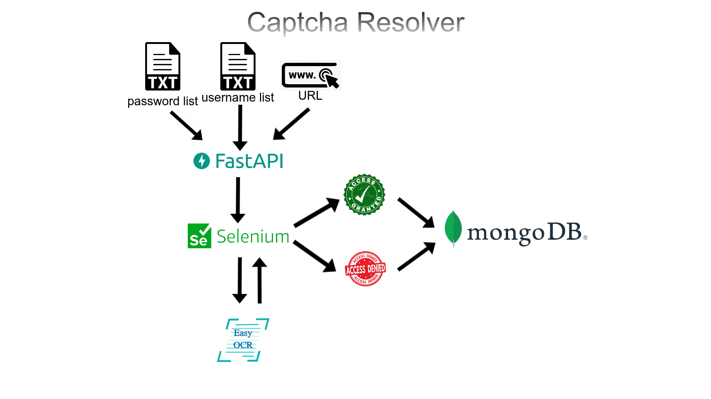

# Captcha Resolver

This is a web application that uses machine learning to solve captchas. It is built with Python FastAPI framework and deployed on Docker Compose.

## Features

- Users can upload an image of a captcha and get the text solution in seconds.
- Users can see the accuracy and performance of the model on different types of captchas.
- Users can download the source code and the trained model from the website.

## Installation

To run this project locally, you need to have Docker and Docker Compose installed on your system. Then follow these steps:

- Clone this repository to your local machine: `git clone https://github.com/hesamdavarpanah/captcha_resolver.git`
- Navigate to the project directory: `cd captcha_resolver`
- Build and run the Docker containers: `docker-compose up -d`
- Open your browser and go to http://localhost:8000/ to see the website.

## Testing

To run the tests, use this command: `docker-compose run web pytest`

## License

This project is licensed under the Apache License 2.0. See the [[LICENSE]](https://github.com/hesamdavarpanah/CRUD-RDF-data/blob/main/LICENSE)https://github.com/hesamdavarpanah/CRUD-RDF-data/blob/main/LICENSE file for more details.
