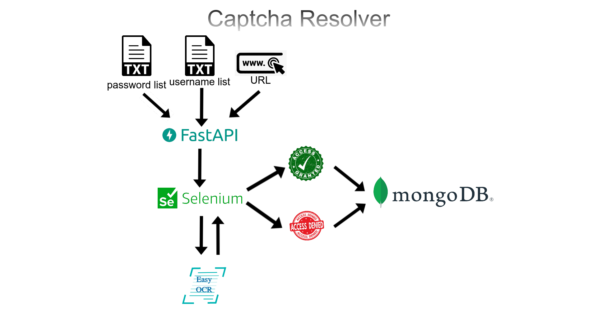

# Captcha Resolver

This web application deployed with FastAPI. The web application will take URL, username list, password list. Then
FastAPI will open the URL with Selenium and will extract the Captcha image with Pyautogui, Then the Captcha image given
to EasyOCR and the result will put to the Captcha input box. This method will repeat for each username with all passwords.
At last the result of access will store in the MongoDB.

